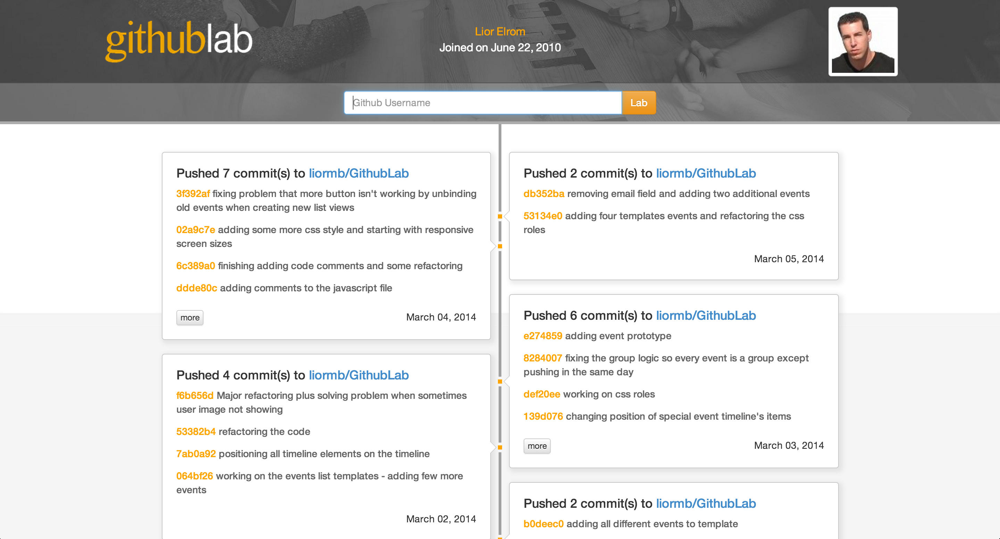

# GithubLab
By [Lior Elrom](http://liormb.com/).

#### <http://githublab.herokuapp.com>

- - -

## GithubLab is a different perspective of presenting a github user activity.


######Welcome screen with different github users

#### It allows a more clear, vizual and kohirent way of presenting a user Github public activities on a vertical timeline.

- - -

#### The idea of presenting Github public activities on a timeline was taken from Facebook and other application that are using a timeline as a better way of presenting data to a user.


######Searching result of a user presented on a timeline

## Technologies

GithubLab is a one-page application that was built using ```Backbone.js``` and ```Underscore.js``` along with ```jQuery``` and of course the ```Github API``` (which currently supporting [16 different events](https://developer.github.com/v3/activity/events/)).

#### The application is using 5 different objects, that each of them is divided into _Models_, _Collections_ and _Views_:

1. **UserInputView** - handle the user input (sanitize and escape bad charicters)
2. **User** - handle the user itself in regards of its information and public events
3. **Responce** - getting all responses from the ```Github API```
4. **Timeline** - building the timeline and its groups
5. **Commit** - handle all the commits when a _Push Event_ occur

###

```javascript
/* a timeline model: containing a group of events */
var Timeline = Backbone.Model.extend({});

/* set of timeline list */
var TimelineCollection = Backbone.Collection.extend({
    model: Timeline
});

/* setting the specific timeline template */
var TimelineView = Backbone.View.extend({
	tagName: 'li',
	template: function() {
		return _.template( $("#" + this.templateName).html() );
	},
	render: function() {
		this.$el.html( this.template()(this.model.attributes) );
		return this;
	}
});
```
###

It's using the ```Github API``` to fetch a user public events data and then processing it by dividing it to seperate groups based on the day, time and type they were happaning.

###

```javascript
/* getting all the user events from the AJAX response */
var events = [];
_.each(responses, function(response) {
	events = events.concat(response.responseJSON);
});

/* making groups */
var groups = self.createGroupEvents(events);

/* bulding a list of timeline models from groups  */
var timelines = [];
_.each(groups, function(group, index) {
	timelines.push(new Timeline(content(group)));
});
```

Those groups are presented as blocks on the timeline, organized by a chronological order from this present towards the past.

This application is using ```Bootstrap``` as its core however, **all** the timeline display is custom made, including the tooltip of each group block.

```css
#timeline-container > li {
    word-wrap: break-word;
	position: absolute;
	width: 48.7%;
	padding: 0 20px 20px;
	border: 1px solid rgb(200,200,200);
	border-radius: 4px;
	-webkit-box-shadow: 3px 3px 8px 3px rgba(160,160,160,.2);
	-moz-box-box-shadow: 3px 3px 8px 3px rgba(160,160,160,.2);
	box-shadow: 3px 3px 8px 3px rgba(160,160,160,.2);
}
```
and the tooltip...
```css
.tooltip-left:after, .tooltip-left:before,
.tooltip-right:after, .tooltip-right:before {
    top: 50%;
	border: solid transparent;
	content: " ";
	height: 0;
	width: 0;
	position: absolute;
	pointer-events: none;
}
```

## Documentation

All the code in the ```javascript``` file is well commented for future use and understanding.
```javascript
var TimelineListView = Backbone.View.extend({
    el: $('#timeline-container'),
	initialize: function(options) {
		this.detatchEvents();
		$(window).on('resize', function() {
			if ($(window).width() <= 600) {
				//needs to refresh the page by calling this.refreshTimeline
			}	
		});
		this.collection = options.collection;
		this.render(); /* auto rendering on every call */
	},
	detatchEvents: function() {
		// when creating a new view, all old views still bound to old events
		// which makes click event fire twise: one bc the old binding and another for the new binding
		// unbinding old events upon creating new ones preventing it to happen 
   	if (this.model != undefined) 
   		this.model.unbind();
   	$(this.el).unbind();
  },
	events: {
    'click #more-submit': 'refreshTimeline',
  },
  ...
```

## Possibile Errors 
The ```Github API``` that is being used in this application is the latest ```V3``` however, on mid October, 2011 Github changed its API structure to the current one we are using today.
I made an effort to complay with the older version as well however, some user events might need more ajustments to be presented smoothly.
